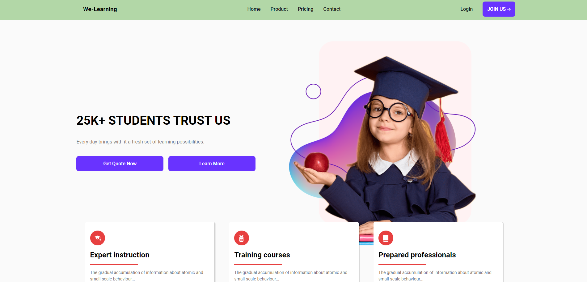

# We-Learning
 
 <div align="center">
   
 </div> 

  &#xa0;


</div>

<p align="center">
  <a href="#dart-sobre">Sobre</a> &#xa0; | &#xa0;   
  <a href="#rocket-tecnologias">Tecnologias</a> &#xa0; | &#xa0;
  <a href="#white_check_mark-pré-requesitos">Pré-requisitos</a> &#xa0; | &#xa0;
  <a href="#checkered_flag-começando">Iniciando</a> &#xa0; | &#xa0;  
</p>

<br>

## :dart: Sobre ##

<p> A aplicação consistem em uma página estática de uma empresa voltada para a área de educação online.</p>

## :rocket: Tecnologias ##

As seguintes ferramentas foram usadas na construção do projeto:

- [React](https://pt-br.reactjs.org/)
- [Yarn](https://yarnpkg.com/)
- [Next](https://nextjs.org/)
- [Styled-Components](https://styled-components.com/)
- [Vite](https://vitejs.dev/)

## :white_check_mark: Pré-requisitos ##

Antes de começar :checkered_flag:, você precisa ter o [Git](https://git-scm.com) e o [Node](https://nodejs.org/en/) instalados no PC!

## :checkered_flag: Iniciando ##

```bash
# Clone este repositório
$ git clone https://github.com/gabivechiatto/we-learning

# Entre na pasta
$ cd we-learning

# Instale as dependências
$ yarn

# Para iniciar rodar projeto local
$ yarn dev
```

&#xa0;

<a href="#top">Voltar para o topo</a>
